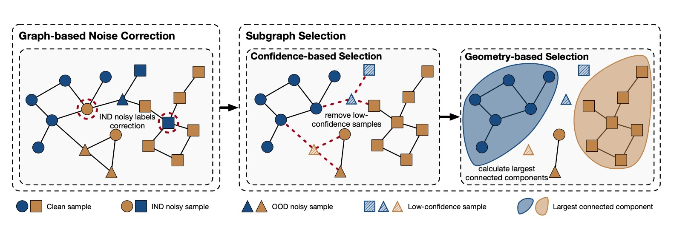

# NGC: A Unified Framework for Learning with Open-World Noisy Data
[[Paper]](https://openaccess.thecvf.com/content/ICCV2021/papers/Wu_NGC_A_Unified_Framework_for_Learning_With_Open-World_Noisy_Data_ICCV_2021_paper.pdf).

## Introduction

We propose a new graph-based framework, namely Noisy Graph Clean- ing (NGC), which collects clean samples by leveraging
ge- ometric structure of data and model predictive confidence.



## Results

Hyper parameters can be found in configs folder.

## Datasets

We provide all necessary datasets to reproduce results declared in paper. Please refer [Baidu](https://pan.baidu.com/s/1vaHTOh4oJrk6gr3UMS48wA)(code:a7d4).

## Example usage

#### Requirements and Installation

* Install requirements by

```
cd papers/ICCV2021-NGC
pip install -r requirements.txt
```

* Build c++ library

```
cd impls
python setup.py build_ext -i
cd ..
```

#### Usage

* Run

```
python run.py --config configs/cifar10_sym.py
```

* Change random seed

```
python run.py --config config/cifar10_sym.py --work_dir work_cifar10_sym --seed 1001
```


## Citing NGC
If you find NGC useful for your research, please consider citing the paper as follows:
```BibTeX
@article{2021NGC,
  title={NGC: A Unified Framework for Learning with Open-World Noisy Data},
  author={ Wu, Zhi Fan  and  Wei, Tong  and  Jiang, Jianwen  and  Mao, Chaojie  and  Tang, Mingqian  and  Li, Yu Feng },
  year={2021},
}
```

